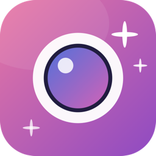

# PhotoBooth Pro

<p align="left">
  
</p>

A native macOS photo booth app with two key differences from Apple's stock one:

- **Non-mirrored by default is a toggle.** Mirror (classic webcam) is the
  default, but you can flip to WYSIWYG (others' POV) with one click in the
  bottom toolbar. Both preview and captured photos/videos honor the choice.
- **AI Effects.** On top of 10 real-time Core Image filters (Mono, Noir,
  Chrome, Sepia, Vivid, Thermal, X-Ray, Comic, Invert, Pixellate), four slow
  server-side styles are available behind an **Advanced** toggle:
  Ghibli / Anime / Oil Painting / Pixel Art.

Plus: screen-flash, video recording, session gallery.

## Why it exists

Apple's Photo Booth is frozen in amber. This one is a tiny SwiftUI app that:

- Runs a **Core Image** filter graph on every camera frame (GPU, ~60 fps).
- Ships a live filter preview per tile in the Effects grid.
- For AI styles, posts `chat/completions` to
  [OpenRouter](https://openrouter.ai) with
  `model: openai/gpt-5.4-image-2` (GPT Image 2), and falls back to the local
  `codex` CLI when you don't have an OpenRouter key.
- Never opens the macOS Keychain; keys go into a plain plist file you can
  `rm` at any time.

## Build & run

```bash
brew install xcodegen
git clone https://github.com/0smboy/PhotoBoothPro.git
cd PhotoBoothPro
xcodegen
open PhotoBoothPro.xcodeproj
# Cmd+R in Xcode
```

### Enabling AI styles

You have two options:

1. **OpenRouter (recommended, fast ~15-30s)**
   - Grab a key at <https://openrouter.ai/keys>.
   - Paste it into the onboarding sheet or `Cmd+,` → Settings.
   - Saved to `~/Library/Application Support/PhotoBoothPro/config.plist`
     (chmod 0600). Or export `$OPENROUTER_API_KEY` in your shell.
2. **Codex CLI fallback (slow 2-5 min)**
   - `brew install codex && codex login`
   - Used automatically when no OpenRouter key is configured.

Real-time filters work with no key. If you just want Mono / Thermal /
Comic etc., you can skip the whole AI section.

## Controls

| Shortcut | Action |
| --- | --- |
| `Space` | Take photo |
| `⌘R` | Start / stop recording |
| `E` | Toggle Effects panel |
| `Esc` | Close Effects panel |
| `⌘,` | Open Settings |

## Output

All captures land in `~/Pictures/PhotoBoothPro/`.

- Photos: `photoboothpro-<timestamp>-<effect>.png`
- Videos: `photoboothpro-<timestamp>-<effect>.mov` (raw mirrored feed,
  filter not baked in yet — v2 will use AVAssetWriter for filtered video).

## Architecture

```
Sources/PhotoBoothPro/
├── Camera/
│   ├── CameraManager.swift        AVCaptureSession + CIFilter pipeline + recording
│   ├── CameraPreviewView.swift    MTKView-backed Core Image renderer
│   ├── FrameBroadcaster.swift     fan-out so every tile can show its own live filter
│   ├── FlashMode.swift
│   └── PhotoCaptureDelegate.swift
├── Effects/
│   ├── Effect.swift               `Effect = .local(LocalFilter) | .ai(AIStyle)`
│   ├── StylePrompts.swift
│   ├── EffectsGridView.swift      Advanced toggle gates AI tiles
│   └── EffectTileView.swift       per-tile live filtered preview
├── AI/
│   ├── ImageEditService.swift     facade: OpenRouter first, codex fallback
│   ├── OpenRouterImageClient.swift
│   ├── CodexImageClient.swift
│   ├── CodexAvailability.swift
│   └── APIKeyStore.swift          plist, NOT Keychain
├── Gallery/                        PhotoStore + PhotoItem + strip view
├── UI/                             Onboarding, Settings, shutter, record, mirror, flash…
├── ContentView.swift               top-level wiring
└── PhotoBoothProApp.swift
```

## Tech notes

- **Mirror** is applied via `CIImage.transformed(by: scaleX: -1)` on
  captured photos (so preview + capture stay in lockstep) and via
  `AVCaptureConnection.isVideoMirrored` on the recording output.
- **AI backend** goes through OpenRouter's
  `/api/v1/chat/completions` with `modalities: ["image", "text"]`; the
  response's `choices[0].message.images[0].image_url.url` is a
  `data:image/png;base64,…` URL that we decode straight into
  `PhotoStore`.
- **App Sandbox is off** so `Process` can spawn the fallback `codex` CLI.
  Camera and microphone entitlements are declared; mic access is requested
  lazily (recording stays silent if denied, no crash).
- No third-party Swift deps — only system frameworks.

## Roadmap

- [ ] AVAssetWriter-based filtered video recording
- [ ] Per-effect photo strip (4-up classic Photo Booth layout)
- [ ] More local filters (dot screen, edge work, sketch)

## License

MIT.
